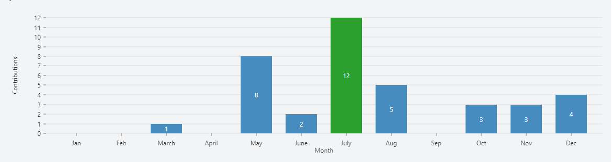

I have a passion for creating dynamic and user friendly web applications using react, node, express, monboDB, javaScript, taiwind css, scss, mui and other related framework and libraries. Also adept at collaborating with cross-functional teams to analyze requirements, design innovative features, and implement scalable systems. Seeking to contribute my skills and enthusiasm for cutting-edge technologies in a challenging
development role.

## Sterk State

## Technologies

## Contribution

<svg xmlns="http://www.w3.org/2000/svg" width="1143.328125" height="292" role="img" focusable="false"><rect width="1143.328125" height="292" fill="transparent"></rect><g transform="translate(80,30)"><g><line opacity="1" x1="0" x2="1063.328125" y1="222" y2="222" stroke="#dddddd" stroke-width="1"></line><line opacity="1" x1="0" x2="1063.328125" y1="204" y2="204" stroke="#dddddd" stroke-width="1"></line><line opacity="1" x1="0" x2="1063.328125" y1="185" y2="185" stroke="#dddddd" stroke-width="1"></line><line opacity="1" x1="0" x2="1063.328125" y1="167" y2="167" stroke="#dddddd" stroke-width="1"></line><line opacity="1" x1="0" x2="1063.328125" y1="148" y2="148" stroke="#dddddd" stroke-width="1"></line><line opacity="1" x1="0" x2="1063.328125" y1="129" y2="129" stroke="#dddddd" stroke-width="1"></line><line opacity="1" x1="0" x2="1063.328125" y1="111" y2="111" stroke="#dddddd" stroke-width="1"></line><line opacity="1" x1="0" x2="1063.328125" y1="92" y2="92" stroke="#dddddd" stroke-width="1"></line><line opacity="1" x1="0" x2="1063.328125" y1="74" y2="74" stroke="#dddddd" stroke-width="1"></line><line opacity="1" x1="0" x2="1063.328125" y1="56" y2="56" stroke="#dddddd" stroke-width="1"></line><line opacity="1" x1="0" x2="1063.328125" y1="37" y2="37" stroke="#dddddd" stroke-width="1"></line><line opacity="1" x1="0" x2="1063.328125" y1="19" y2="19" stroke="#dddddd" stroke-width="1"></line><line opacity="1" x1="0" x2="1063.328125" y1="0" y2="0" stroke="#dddddd" stroke-width="1"></line></g><g transform="translate(0,222)"><g transform="translate(59,0)" style="opacity: 1;"><line x1="0" x2="0" y1="0" y2="5" style="stroke: rgb(119, 119, 119); stroke-width: 1;"></line><text dominant-baseline="text-before-edge" text-anchor="middle" transform="translate(0,10) rotate(0)" style="font-family: &quot;Segoe UI&quot;; font-size: 12px; fill: rgb(51, 51, 51);">Jan</text></g><g transform="translate(145,0)" style="opacity: 1;"><line x1="0" x2="0" y1="0" y2="5" style="stroke: rgb(119, 119, 119); stroke-width: 1;"></line><text dominant-baseline="text-before-edge" text-anchor="middle" transform="translate(0,10) rotate(0)" style="font-family: &quot;Segoe UI&quot;; font-size: 12px; fill: rgb(51, 51, 51);">Feb</text></g><g transform="translate(231,0)" style="opacity: 1;"><line x1="0" x2="0" y1="0" y2="5" style="stroke: rgb(119, 119, 119); stroke-width: 1;"></line><text dominant-baseline="text-before-edge" text-anchor="middle" transform="translate(0,10) rotate(0)" style="font-family: &quot;Segoe UI&quot;; font-size: 12px; fill: rgb(51, 51, 51);">March</text></g><g transform="translate(317,0)" style="opacity: 1;"><line x1="0" x2="0" y1="0" y2="5" style="stroke: rgb(119, 119, 119); stroke-width: 1;"></line><text dominant-baseline="text-before-edge" text-anchor="middle" transform="translate(0,10) rotate(0)" style="font-family: &quot;Segoe UI&quot;; font-size: 12px; fill: rgb(51, 51, 51);">April</text></g><g transform="translate(403,0)" style="opacity: 1;"><line x1="0" x2="0" y1="0" y2="5" style="stroke: rgb(119, 119, 119); stroke-width: 1;"></line><text dominant-baseline="text-before-edge" text-anchor="middle" transform="translate(0,10) rotate(0)" style="font-family: &quot;Segoe UI&quot;; font-size: 12px; fill: rgb(51, 51, 51);">May</text></g><g transform="translate(489,0)" style="opacity: 1;"><line x1="0" x2="0" y1="0" y2="5" style="stroke: rgb(119, 119, 119); stroke-width: 1;"></line><text dominant-baseline="text-before-edge" text-anchor="middle" transform="translate(0,10) rotate(0)" style="font-family: &quot;Segoe UI&quot;; font-size: 12px; fill: rgb(51, 51, 51);">June</text></g><g transform="translate(575,0)" style="opacity: 1;"><line x1="0" x2="0" y1="0" y2="5" style="stroke: rgb(119, 119, 119); stroke-width: 1;"></line><text dominant-baseline="text-before-edge" text-anchor="middle" transform="translate(0,10) rotate(0)" style="font-family: &quot;Segoe UI&quot;; font-size: 12px; fill: rgb(51, 51, 51);">July</text></g><g transform="translate(661,0)" style="opacity: 1;"><line x1="0" x2="0" y1="0" y2="5" style="stroke: rgb(119, 119, 119); stroke-width: 1;"></line><text dominant-baseline="text-before-edge" text-anchor="middle" transform="translate(0,10) rotate(0)" style="font-family: &quot;Segoe UI&quot;; font-size: 12px; fill: rgb(51, 51, 51);">Aug</text></g><g transform="translate(747,0)" style="opacity: 1;"><line x1="0" x2="0" y1="0" y2="5" style="stroke: rgb(119, 119, 119); stroke-width: 1;"></line><text dominant-baseline="text-before-edge" text-anchor="middle" transform="translate(0,10) rotate(0)" style="font-family: &quot;Segoe UI&quot;; font-size: 12px; fill: rgb(51, 51, 51);">Sep</text></g><g transform="translate(833,0)" style="opacity: 1;"><line x1="0" x2="0" y1="0" y2="5" style="stroke: rgb(119, 119, 119); stroke-width: 1;"></line><text dominant-baseline="text-before-edge" text-anchor="middle" transform="translate(0,10) rotate(0)" style="font-family: &quot;Segoe UI&quot;; font-size: 12px; fill: rgb(51, 51, 51);">Oct</text></g><g transform="translate(919,0)" style="opacity: 1;"><line x1="0" x2="0" y1="0" y2="5" style="stroke: rgb(119, 119, 119); stroke-width: 1;"></line><text dominant-baseline="text-before-edge" text-anchor="middle" transform="translate(0,10) rotate(0)" style="font-family: &quot;Segoe UI&quot;; font-size: 12px; fill: rgb(51, 51, 51);">Nov</text></g><g transform="translate(1005,0)" style="opacity: 1;"><line x1="0" x2="0" y1="0" y2="5" style="stroke: rgb(119, 119, 119); stroke-width: 1;"></line><text dominant-baseline="text-before-edge" text-anchor="middle" transform="translate(0,10) rotate(0)" style="font-family: &quot;Segoe UI&quot;; font-size: 12px; fill: rgb(51, 51, 51);">Dec</text></g><line x1="0" x2="1063.328125" y1="0" y2="0" style="stroke: transparent; stroke-width: 1;"></line><text transform="translate(531.6640625, 32) rotate(0)" text-anchor="middle" style="dominant-baseline: central; font-size: 12px; font-family: &quot;Segoe UI&quot;; fill: rgb(51, 51, 51);">Month</text></g><g transform="translate(0,0)"><g transform="translate(0,222)" style="opacity: 1;"><line x1="0" x2="-5" y1="0" y2="0" style="stroke: rgb(119, 119, 119); stroke-width: 1;"></line><text dominant-baseline="central" text-anchor="end" transform="translate(-10,0) rotate(0)" style="font-family: &quot;Segoe UI&quot;; font-size: 12px; fill: rgb(51, 51, 51);">0</text></g><g transform="translate(0,204)" style="opacity: 1;"><line x1="0" x2="-5" y1="0" y2="0" style="stroke: rgb(119, 119, 119); stroke-width: 1;"></line><text dominant-baseline="central" text-anchor="end" transform="translate(-10,0) rotate(0)" style="font-family: &quot;Segoe UI&quot;; font-size: 12px; fill: rgb(51, 51, 51);">1</text></g><g transform="translate(0,185)" style="opacity: 1;"><line x1="0" x2="-5" y1="0" y2="0" style="stroke: rgb(119, 119, 119); stroke-width: 1;"></line><text dominant-baseline="central" text-anchor="end" transform="translate(-10,0) rotate(0)" style="font-family: &quot;Segoe UI&quot;; font-size: 12px; fill: rgb(51, 51, 51);">2</text></g><g transform="translate(0,167)" style="opacity: 1;"><line x1="0" x2="-5" y1="0" y2="0" style="stroke: rgb(119, 119, 119); stroke-width: 1;"></line><text dominant-baseline="central" text-anchor="end" transform="translate(-10,0) rotate(0)" style="font-family: &quot;Segoe UI&quot;; font-size: 12px; fill: rgb(51, 51, 51);">3</text></g><g transform="translate(0,148)" style="opacity: 1;"><line x1="0" x2="-5" y1="0" y2="0" style="stroke: rgb(119, 119, 119); stroke-width: 1;"></line><text dominant-baseline="central" text-anchor="end" transform="translate(-10,0) rotate(0)" style="font-family: &quot;Segoe UI&quot;; font-size: 12px; fill: rgb(51, 51, 51);">4</text></g><g transform="translate(0,129)" style="opacity: 1;"><line x1="0" x2="-5" y1="0" y2="0" style="stroke: rgb(119, 119, 119); stroke-width: 1;"></line><text dominant-baseline="central" text-anchor="end" transform="translate(-10,0) rotate(0)" style="font-family: &quot;Segoe UI&quot;; font-size: 12px; fill: rgb(51, 51, 51);">5</text></g><g transform="translate(0,111)" style="opacity: 1;"><line x1="0" x2="-5" y1="0" y2="0" style="stroke: rgb(119, 119, 119); stroke-width: 1;"></line><text dominant-baseline="central" text-anchor="end" transform="translate(-10,0) rotate(0)" style="font-family: &quot;Segoe UI&quot;; font-size: 12px; fill: rgb(51, 51, 51);">6</text></g><g transform="translate(0,92)" style="opacity: 1;"><line x1="0" x2="-5" y1="0" y2="0" style="stroke: rgb(119, 119, 119); stroke-width: 1;"></line><text dominant-baseline="central" text-anchor="end" transform="translate(-10,0) rotate(0)" style="font-family: &quot;Segoe UI&quot;; font-size: 12px; fill: rgb(51, 51, 51);">7</text></g><g transform="translate(0,74)" style="opacity: 1;"><line x1="0" x2="-5" y1="0" y2="0" style="stroke: rgb(119, 119, 119); stroke-width: 1;"></line><text dominant-baseline="central" text-anchor="end" transform="translate(-10,0) rotate(0)" style="font-family: &quot;Segoe UI&quot;; font-size: 12px; fill: rgb(51, 51, 51);">8</text></g><g transform="translate(0,56)" style="opacity: 1;"><line x1="0" x2="-5" y1="0" y2="0" style="stroke: rgb(119, 119, 119); stroke-width: 1;"></line><text dominant-baseline="central" text-anchor="end" transform="translate(-10,0) rotate(0)" style="font-family: &quot;Segoe UI&quot;; font-size: 12px; fill: rgb(51, 51, 51);">9</text></g><g transform="translate(0,37)" style="opacity: 1;"><line x1="0" x2="-5" y1="0" y2="0" style="stroke: rgb(119, 119, 119); stroke-width: 1;"></line><text dominant-baseline="central" text-anchor="end" transform="translate(-10,0) rotate(0)" style="font-family: &quot;Segoe UI&quot;; font-size: 12px; fill: rgb(51, 51, 51);">10</text></g><g transform="translate(0,19)" style="opacity: 1;"><line x1="0" x2="-5" y1="0" y2="0" style="stroke: rgb(119, 119, 119); stroke-width: 1;"></line><text dominant-baseline="central" text-anchor="end" transform="translate(-10,0) rotate(0)" style="font-family: &quot;Segoe UI&quot;; font-size: 12px; fill: rgb(51, 51, 51);">11</text></g><g transform="translate(0,0)" style="opacity: 1;"><line x1="0" x2="-5" y1="0" y2="0" style="stroke: rgb(119, 119, 119); stroke-width: 1;"></line><text dominant-baseline="central" text-anchor="end" transform="translate(-10,0) rotate(0)" style="font-family: &quot;Segoe UI&quot;; font-size: 12px; fill: rgb(51, 51, 51);">12</text></g><line x1="0" x2="0" y1="0" y2="222" style="stroke: transparent; stroke-width: 1;"></line><text transform="translate(-60, 111) rotate(-90)" text-anchor="middle" style="dominant-baseline: central; font-size: 12px; font-family: &quot;Segoe UI&quot;; fill: rgb(51, 51, 51);">Contributions</text></g><g transform="translate(29, 222)"><rect width="60" height="0" rx="0" ry="0" fill="#D62728" stroke-width="0" stroke="#D62728" focusable="false"></rect></g><g transform="translate(115, 222)"><rect width="60" height="0" rx="0" ry="0" fill="#D62728" stroke-width="0" stroke="#D62728" focusable="false"></rect></g><g transform="translate(201, 204)"><rect width="60" height="18" rx="0" ry="0" fill="#468CBF" stroke-width="0" stroke="#468CBF" focusable="false"></rect><text x="30" y="9" text-anchor="middle" dominant-baseline="central" fill-opacity="1" style="font-family: &quot;Segoe UI&quot;; font-size: 12px; fill: rgb(255, 255, 255); pointer-events: none;">1</text></g><g transform="translate(287, 222)"><rect width="60" height="0" rx="0" ry="0" fill="#D62728" stroke-width="0" stroke="#D62728" focusable="false"></rect></g><g transform="translate(373, 74)"><rect width="60" height="148" rx="0" ry="0" fill="#468CBF" stroke-width="0" stroke="#468CBF" focusable="false"></rect><text x="30" y="74" text-anchor="middle" dominant-baseline="central" fill-opacity="1" style="font-family: &quot;Segoe UI&quot;; font-size: 12px; fill: rgb(255, 255, 255); pointer-events: none;">8</text></g><g transform="translate(459, 185)"><rect width="60" height="37" rx="0" ry="0" fill="#468CBF" stroke-width="0" stroke="#468CBF" focusable="false"></rect><text x="30" y="18.5" text-anchor="middle" dominant-baseline="central" fill-opacity="1" style="font-family: &quot;Segoe UI&quot;; font-size: 12px; fill: rgb(255, 255, 255); pointer-events: none;">2</text></g><g transform="translate(545, 0)"><rect width="60" height="222" rx="0" ry="0" fill="#2BA02C" stroke-width="0" stroke="#2BA02C" focusable="false"></rect><text x="30" y="111" text-anchor="middle" dominant-baseline="central" fill-opacity="1" style="font-family: &quot;Segoe UI&quot;; font-size: 12px; fill: rgb(255, 255, 255); pointer-events: none;">12</text></g><g transform="translate(631, 129)"><rect width="60" height="93" rx="0" ry="0" fill="#468CBF" stroke-width="0" stroke="#468CBF" focusable="false"></rect><text x="30" y="46.5" text-anchor="middle" dominant-baseline="central" fill-opacity="1" style="font-family: &quot;Segoe UI&quot;; font-size: 12px; fill: rgb(255, 255, 255); pointer-events: none;">5</text></g><g transform="translate(717, 222)"><rect width="60" height="0" rx="0" ry="0" fill="#D62728" stroke-width="0" stroke="#D62728" focusable="false"></rect></g><g transform="translate(803, 167)"><rect width="60" height="55" rx="0" ry="0" fill="#468CBF" stroke-width="0" stroke="#468CBF" focusable="false"></rect><text x="30" y="27.5" text-anchor="middle" dominant-baseline="central" fill-opacity="1" style="font-family: &quot;Segoe UI&quot;; font-size: 12px; fill: rgb(255, 255, 255); pointer-events: none;">3</text></g><g transform="translate(889, 167)"><rect width="60" height="55" rx="0" ry="0" fill="#468CBF" stroke-width="0" stroke="#468CBF" focusable="false"></rect><text x="30" y="27.5" text-anchor="middle" dominant-baseline="central" fill-opacity="1" style="font-family: &quot;Segoe UI&quot;; font-size: 12px; fill: rgb(255, 255, 255); pointer-events: none;">3</text></g><g transform="translate(975, 148)"><rect width="60" height="74" rx="0" ry="0" fill="#468CBF" stroke-width="0" stroke="#468CBF" focusable="false"></rect><text x="30" y="37" text-anchor="middle" dominant-baseline="central" fill-opacity="1" style="font-family: &quot;Segoe UI&quot;; font-size: 12px; fill: rgb(255, 255, 255); pointer-events: none;">4</text></g></g></svg>

