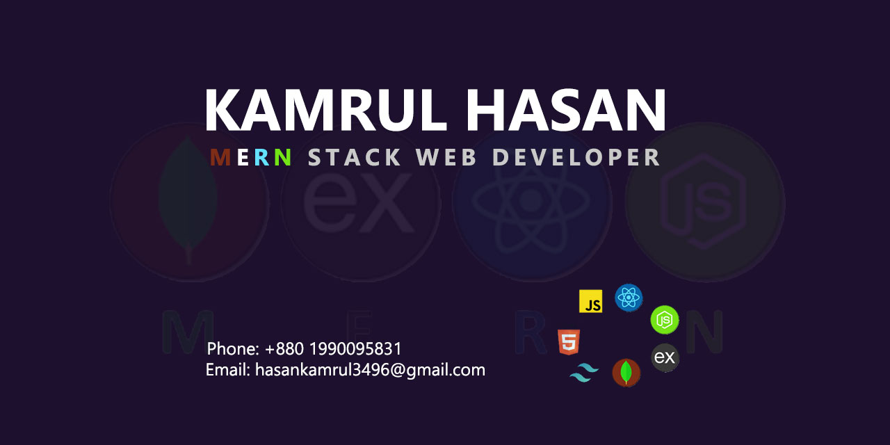

I have a passion for creating dynamic and user friendly web applications using react, node, express, monboDB, javaScript, taiwind css, scss, mui and other related framework and libraries. Also adept at collaborating with cross-functional teams to analyze requirements, design innovative features, and implement scalable systems. Seeking to contribute my skills and enthusiasm for cutting-edge technologies in a challenging
development role.

## Streak Stats

## Technologies

